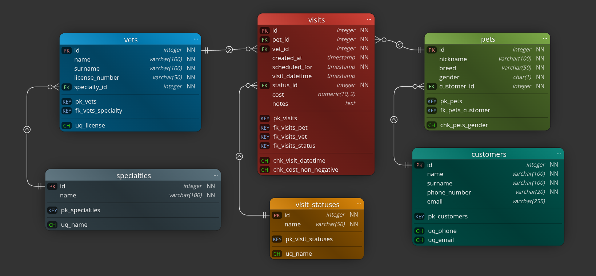

# Part 1: Scenario

Dog veterinarian clinic management (9) is chosen for this homework. The system will manage vet doctors, pets, their owners (customers) and visits.

# Part 2: Database project and documentation

## Entities and attributes identification:

1. Vet doctors (vets)
2. Vet specialties (specialties): lookup table.
3. Pets (pets)
4. Pet owners/customers (customers)
5. Visits (visits): associative table.
6. Visit statuses (visit\_statuses): look-up table.

## Tables project:

1. **Table Name: `vets`**
   * **Description**: keeps information on veterinarian doctors employed in the clinic.
   * **Attributes**:
     ```sql
     -- id:
     INTEGER, PK, NOT NULL, UNIQUE
     -- name:
     VARCHAR(100), NOT NULL
     -- surname:
     VARCHAR(100), NOT NULL
     -- license_number:
     VARCHAR(50), NOT NULL UNIQUE
     -- specialty_id:
     INTEGER, FK (REFERENCES specialties), NOT NULL
     ```
   * **Constraints**:
     ```sql
     -- pk_vets:
     PRIMARY KEY (id)
     -- uq_license:
     UNIQUE (license_number)
     -- fk_vets_specialty:
     FOREIGN KEY (specialty_id) REFERENCES specialties(id)
     ```
2. **Table Name: `specialties`**
   * **Description**: lookup table that stores the allowed veterinarian specialties.
   * **Attributes**:
     ```sql
     -- id:
     INTEGER, PK, NOT NULL, UNIQUE
     -- name:
     VARCHAR(100), NOT NULL
     ```
   * **Constraints**:
     ```sql
     -- pk_specialties:
     PRIMARY KEY (id)
     -- uq_name:
     UNIQUE (name)
     ```
3. **Table Name: `pets`**
   * **Description**: keep information on pets visiting the clinic.
   * **Attributes**:
     ```sql
     -- id:
     INTEGER, PK, NOT NULL, UNIQUE
     -- nickname:
     VARCHAR(100), NOT NULL
     -- breed:
     VARCHAR(50), NOT NULL
     -- gender:
     CHAR(1), NOT NULL -- ('M' or 'F')
     -- customer_id:
     INTEGER, FK (REFERENCES customers), NOT NULL
     ```
   * **Constraints**:
     ```sql
     -- pk_pets:
     PRIMARY KEY (id)
     -- fk_pets_customer:
     FOREIGN KEY (customer_id) REFERENCES customers(id)
     -- chk_pets_gender:
     CHECK (gender IN ('M', 'F'))
     ```
4. **Table Name: `customers`**
   * **Description**: keeps info on pet owners (customers).
   * **Attributes**:
     ```sql
     -- id:
     INTEGER, PK, NOT NULL, UNIQUE
     -- name:
     VARCHAR(100), NOT NULL
     -- surname:
     VARCHAR(100), NOT NULL
     -- phone_number:
     VARCHAR(20), NOT NULL, UNIQUE
     -- email:
     VARCHAR(255), UNIQUE
     ```
   * **Constraints**:
     ```sql
     -- pk_customers:
     PRIMARY KEY (id)
     -- uq_phone:
     UNIQUE (phone_number)
     -- uq_email:
     UNIQUE (email)
     ```
5. **Table Name: `visits`**
   * **Description**: associative table to describe M:M relationship. Keeps information about pet visits.
   * **Attributes**:
     ```sql
     -- id:
     INTEGER, PK, NOT NULL, UNIQUE
     -- pet_id:
     INTEGER, FK (REFERENCES pets), NOT NULL
     -- vet_id:
     INTEGER, FK (REFERENCES vets), NOT NULL
     -- created_at:
     TIMESTAMP, NOT NULL, DEFAULT CURRENT_TIMESTAMP
     -- scheduled_for:
     TIMESTAMP, NOT NULL
     -- visit_datetime:
     TIMESTAMP
     -- status_id:
     INTEGER, FK (REFERENCES visit_statuses), NOT NULL
     -- cost:
     NUMERIC(10, 2)
     -- notes:
     TEXT
     ```
   * **Constraints**:
     ```sql
     -- pk_visits:
     PRIMARY KEY (id)
     -- fk_visits_pet:
     FOREIGN KEY (pet_id) REFERENCES pets(id)
     -- fk_visits_vet:
     FOREIGN KEY (vet_id) REFERENCES vets(id)
     -- fk_visits_status:
     FOREIGN KEY (status_id) REFERENCES visit_statuses(id)
     -- chk_visit_datetime:
     CHECK (visit_datetime IS NULL OR visit_datetime >= scheduled_for)
     -- chk_cost_non_negative:
     CHECK (cost IS NULL OR cost >= 0)
     ```
6. **Table Name: `visit_statuses`**
   * **Description**: lookup table that stores the allowed statuses for visits.
   * **Attributes**:
     ```sql
     -- id:
     INTEGER, PK, NOT NULL, UNIQUE
     -- name:
     VARCHAR(50), NOT NULL
     ```
   * **Constraints**:
     ```sql
     -- pk_visit_statuses:
     PRIMARY KEY (id)
     -- uq_name:
     UNIQUE (name)
     ```

# Part 3: Relationships

* **`vets`** and **`specialties`** (one-to-many): one vet can have exactly one specialty in this simplified design, while each specialty can belong to many vets.
  * **`vets.specialty_id`** is a foreign key referencing **`specialties.id`**
* **`pets`** and **`customers`** (one-to-many): one pet can have exactly one owner (customer), while each customer can own many pets.
  * **`pets.customer_id`** is a foreign key referencing **`customers.id`**
* **`visits`** and **`visit_statuses`** (one-to-many): only one status is allowed per visit, but each status can refer to many visits.
  * **`visits.status_id`** is a foreign key referencing **`visit_statuses.id`**
* **`visits`** and **`vets`** (one-to-many): one visit can have exactly one vet, while each vet can have many visits.
  * **`visits.vet_id`** is a foreign key referencing **`vets.id`**
* **`visits`** and **`pets`** (one-to-many): one visit can have exactly one pet, while each pet can have many visits.
  * **`visits.pet_id`** is a foreign key referencing **`pets.id`**
* **`pets`** and **`vets`** (many-to-many via **`visits`**): a pet can be seen by many vets over time, and a vet can treat many pets. Implemented through the associative table **`visits`**, using two one-to-many relationships **`(visits.vet_id`** \-\> **`vets.id`** and **`visits.pet_id`** \-\> **`pets.id`**).

# Part 4: ER diagram


