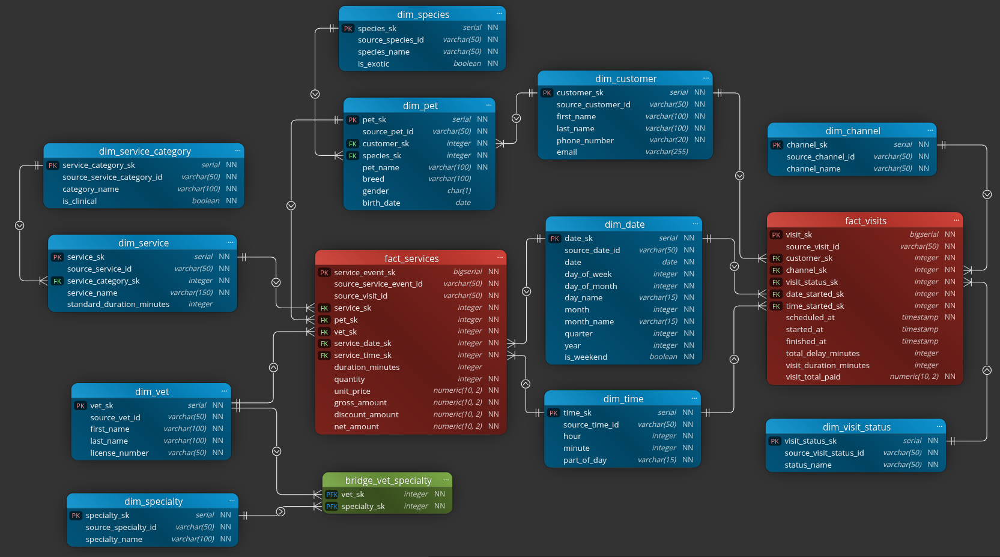

# Data Warehouse Model

## Business process

This DWH model describes veterinarian visits and service delivery as business process within a single veterinarian clinic.

## Grain

The model uses **Galaxy Schema** to describe related processes, represented as two separate fact tables, being visits and services, each with its own grain level:
- **Visits**: higher-level grain, one row per customer visit.
- **Services**: more detailed grain, one row per service type provided to a pet during a visit.

This design makes broad analysis easier. Using a single fact table, it would be quite difficult to represent both high-level customer visit lifecycles and more detailed, per-pet service activity without creating grain or duplication problems.

## Entities

### Dimensions

- **`dim_customer`**

Stores descriptive information about pet owners and supports analysis by customer.
```sql
customer_sk         SERIAL          PRIMARY KEY
source_customer_id  VARCHAR(50)     NOT NULL UNIQUE
first_name          VARCHAR(100)    NOT NULL
last_name           VARCHAR(100)    NOT NULL
phone_number        VARCHAR(20)     NOT NULL
email               VARCHAR(255)    NULL
```

- **`dim_pet`**

Stores descriptive information about each pet, connects pets to their customers and species.
```sql
pet_sk            SERIAL        PRIMARY KEY
source_pet_id     VARCHAR(50)   NOT NULL UNIQUE
customer_sk       INTEGER       NOT NULL REFERENCES dim_customer(customer_sk)
species_sk        INTEGER       NOT NULL REFERENCES dim_species(species_sk)
pet_name          VARCHAR(100)  NOT NULL
breed             VARCHAR(100)  NULL
gender            CHAR(1)       NULL CHECK (gender IS NULL OR gender IN ('M', 'F'))
birth_date        DATE          NULL
```

- **`dim_service`**

Stores available services, groups them by category.
`standard_duration_minutes` stores the expected service duration, can be compared with an actual value.
```sql
service_sk                 SERIAL          PRIMARY KEY
source_service_id          VARCHAR(50)     NOT NULL UNIQUE
service_category_sk        INTEGER         NOT NULL REFERENCES dim_service_category(service_category_sk)
service_name               VARCHAR(150)    NOT NULL
standard_duration_minutes  INTEGER         NULL CHECK (standard_duration_minutes IS NULL
                                                       OR standard_duration_minutes >= 0)
```


- **`dim_vet`**

Stores veterinarian identity and license information.
Vets may have multiple specialties through `bridge_vet_specialty`
```sql
vet_sk          SERIAL        PRIMARY KEY
source_vet_id   VARCHAR(50)   NOT NULL UNIQUE
first_name      VARCHAR(100)  NOT NULL
last_name       VARCHAR(100)  NOT NULL
license_number  VARCHAR(50)   NOT NULL UNIQUE
```

- **`dim_service_category`**

Groups individual services into broader categories.
Boolean `is_clinical` used for separating medical activity from other services, e.g. grooming.
```sql
service_category_sk          SERIAL        PRIMARY KEY
source_service_category_id   VARCHAR(50)   NOT NULL UNIQUE
category_name                VARCHAR(100)  NOT NULL UNIQUE
is_clinical                  BOOLEAN       NOT NULL DEFAULT FALSE
```

- **`dim_species`**

Stores species classifications.
Boolean `is_exotic` serves to separate exotic pets.
```sql
species_sk          SERIAL        PRIMARY KEY
source_species_id   VARCHAR(50)   NOT NULL UNIQUE
species_name        VARCHAR(50)   NOT NULL UNIQUE
is_exotic           BOOLEAN       NOT NULL DEFAULT FALSE
```

- **`dim_channel`**

Stores the channel through which a visit was booked or initiated by the customer.
```sql
channel_sk          SERIAL        PRIMARY KEY
source_channel_id   VARCHAR(50)   NOT NULL UNIQUE
channel_name        VARCHAR(50)   NOT NULL UNIQUE
```

- **`dim_visit_status`**

Stores the lifecycle status of a visit, e.g. scheduled, completed, canceled, active.
```sql
visit_status_sk          SERIAL        PRIMARY KEY
source_visit_status_id   VARCHAR(50)   NOT NULL UNIQUE
status_name              VARCHAR(50)   NOT NULL UNIQUE
```

- **`dim_date`**

Provides date attributes for reporting and aggregation.
Special `date_sk = -1` row should represent `Not started/Pending`.
```sql
date_sk          SERIAL        PRIMARY KEY
source_date_id   VARCHAR(50)   NOT NULL UNIQUE
date             DATE          NOT NULL UNIQUE
day_of_week      INTEGER       NOT NULL CHECK (day_of_week BETWEEN 1 AND 7)
day_of_month     INTEGER       NOT NULL CHECK (day_of_month BETWEEN 1 AND 31)
day_name         VARCHAR(15)   NOT NULL
month            INTEGER       NOT NULL CHECK (month BETWEEN 1 AND 12)
month_name       VARCHAR(15)   NOT NULL
quarter          INTEGER       NOT NULL CHECK (quarter BETWEEN 1 AND 4)
year             INTEGER       NOT NULL
is_weekend       BOOLEAN       NOT NULL
```


- **`dim_time`**

Provides time attributes.
Special `time_sk = -1` row should represent `Not started/Pending`.
```sql
time_sk          SERIAL        PRIMARY KEY
source_time_id   VARCHAR(50)   NOT NULL UNIQUE
hour             INTEGER       NOT NULL CHECK (hour BETWEEN 0 AND 23)
minute           INTEGER       NOT NULL CHECK (minute BETWEEN 0 AND 59)
part_of_day      VARCHAR(15)   NOT NULL
```


- **`dim_specialty`**

Stores vet specialty classifications.
```sql
specialty_sk          SERIAL        PRIMARY KEY
source_specialty_id   VARCHAR(50)   NOT NULL UNIQUE
specialty_name        VARCHAR(100)  NOT NULL UNIQUE
```

### Bridge table

- **`bridge_vet_specialty`**

Resolves many-to-many relationship between vets and specialties
```sql
vet_sk       INTEGER  NOT NULL REFERENCES dim_vet(vet_sk)
specialty_sk INTEGER  NOT NULL REFERENCES dim_specialty(specialty_sk)
PRIMARY KEY (vet_sk, specialty_sk)
```

### Fact tables

- **`fact_visits`**

One row represents one customer visit.
```sql
visit_sk                BIGSERIAL       PRIMARY KEY
source_visit_id         VARCHAR(50)     NOT NULL UNIQUE
customer_sk             INTEGER         NOT NULL REFERENCES dim_customer(customer_sk)
channel_sk              INTEGER         NOT NULL REFERENCES dim_channel(channel_sk)
visit_status_sk         INTEGER         NOT NULL REFERENCES dim_visit_status(visit_status_sk)
date_started_sk         INTEGER         NOT NULL DEFAULT -1 REFERENCES dim_date(date_sk)
time_started_sk         INTEGER         NOT NULL DEFAULT -1 REFERENCES dim_time(time_sk)
scheduled_at            TIMESTAMP       NOT NULL
started_at              TIMESTAMP       NULL
finished_at             TIMESTAMP       NULL
total_delay_minutes     INTEGER         NULL CHECK (total_delay_minutes IS NULL OR total_delay_minutes >= 0)
visit_duration_minutes  INTEGER         NULL CHECK (visit_duration_minutes IS NULL OR visit_duration_minutes >= 0)
visit_total_paid        NUMERIC(10, 2)  NOT NULL DEFAULT 0.00 CHECK (visit_total_paid >= 0)
```
`total_delay_minutes` is total accumulated waiting and delay time during the visit.
`visit_total_paid` is total amount for a single visit. Used for convenience and reporting, actual revenue analysis is made through `fact_services`.


- **`fact_services`**

One row per service provided during a visit.
```sql
service_event_sk        BIGSERIAL       PRIMARY KEY
source_service_event_id VARCHAR(50)     NOT NULL UNIQUE
source_visit_id         VARCHAR(50)     NOT NULL
service_sk              INTEGER         NOT NULL REFERENCES dim_service(service_sk)
pet_sk                  INTEGER         NOT NULL REFERENCES dim_pet(pet_sk)
vet_sk                  INTEGER         NOT NULL REFERENCES dim_vet(vet_sk)
service_date_sk         INTEGER         NOT NULL REFERENCES dim_date(date_sk)
service_time_sk         INTEGER         NOT NULL REFERENCES dim_time(time_sk)
duration_minutes        INTEGER         NULL CHECK (duration_minutes IS NULL OR duration_minutes >= 0)
quantity                INTEGER         NOT NULL DEFAULT 1 CHECK (quantity > 0)
unit_price              NUMERIC(10, 2)  NOT NULL CHECK (unit_price >= 0)
gross_amount            NUMERIC(10, 2)  NOT NULL CHECK (gross_amount >= 0)
discount_amount         NUMERIC(10, 2)  NOT NULL DEFAULT 0.00 CHECK (discount_amount >= 0)
net_amount              NUMERIC(10, 2)  NOT NULL CHECK (net_amount >= 0)
```
Main financial metrics:
```sql
gross_amount = quantity * unit_price
net_amount   = gross_amount − discount_amount
```

**`source_visit_id`** business-key is present in both fact tables, and used as **degenerate dimension**, that acts as a link between them, and can be used in queries.
Another aproach could be used, creating a separate bridge table that would connect facts. That is more robust, but leads to increased queries complexity and possible performance loss.


## ER Diagram




## Queries

1. which service categories generate highest net revenue?
```sql
SELECT
    dsc.category_name,
    SUM(fs.net_amount) AS total_net_revenue
FROM
    fact_services AS fs
    INNER JOIN
        dim_service AS ds
        ON fs.service_sk = ds.service_sk
    INNER JOIN
        dim_service_category AS dsc
        ON ds.service_category_sk = dsc.service_category_sk
GROUP BY
    dsc.category_name
ORDER BY
    total_net_revenue DESC;
```

2. which part of the day has the most service activity?
```sql
SELECT
    dt.part_of_day,
    COUNT(*) AS total_services
FROM
    fact_services AS fs
    INNER JOIN
        dim_time AS dt
        ON fs.service_time_sk = dt.time_sk
GROUP BY
    dt.part_of_day
ORDER BY
    total_services DESC;
```

3. are delays during visits higher on weekends or on working days?
```sql
SELECT
    CASE
        WHEN dd.is_weekend THEN 'Weekend'
        ELSE 'Workday'
    END                         AS day_type,
    AVG(fv.total_delay_minutes) AS average_total_delay_minutes
FROM
    fact_visits AS fv
    INNER JOIN
        dim_date AS dd
        ON fv.date_started_sk = dd.date_sk
WHERE
    fv.total_delay_minutes IS NOT NULL
GROUP BY
    dd.is_weekend
ORDER BY
    average_total_delay_minutes DESC;
```

4. what is revenue from clinical services provided to exotic pets?
```sql
SELECT SUM(fs.net_amount) AS clinical_exotic_revenue
FROM
    fact_services AS fs
    INNER JOIN
        dim_service AS ds
        ON fs.service_sk = ds.service_sk
    INNER JOIN
        dim_service_category AS dsc
        ON ds.service_category_sk = dsc.service_category_sk
    INNER JOIN
        dim_pet AS dp
        ON fs.pet_sk = dp.pet_sk
    INNER JOIN
        dim_species AS dsp
        ON dp.species_sk = dsp.species_sk
WHERE
    dsc.is_clinical = TRUE
    AND dsp.is_exotic = TRUE;
```

5. which vets generated highest net revenue and how many services they performed?
```sql
SELECT
    dv.vet_sk,
    dv.first_name,
    dv.last_name,
    SUM(fs.net_amount) AS total_net_revenue,
    COUNT(*)           AS service_count
FROM
    fact_services AS fs
    INNER JOIN
        dim_vet AS dv
        ON fs.vet_sk = dv.vet_sk
GROUP BY
    dv.vet_sk,
    dv.first_name,
    dv.last_name
ORDER BY
    total_net_revenue DESC;
```

6. example check that uses `source_visit_id` to join both facts to compare visit total vs service total for the same visit
```sql
SELECT
    fv.source_visit_id,
    fv.visit_total_paid,
    SUM(fs.net_amount) AS services_total_net_amount
FROM
    fact_visits AS fv
    INNER JOIN
        fact_services AS fs
        ON fv.source_visit_id = fs.source_visit_id
GROUP BY
    fv.source_visit_id
ORDER BY
    fv.source_visit_id;
```
