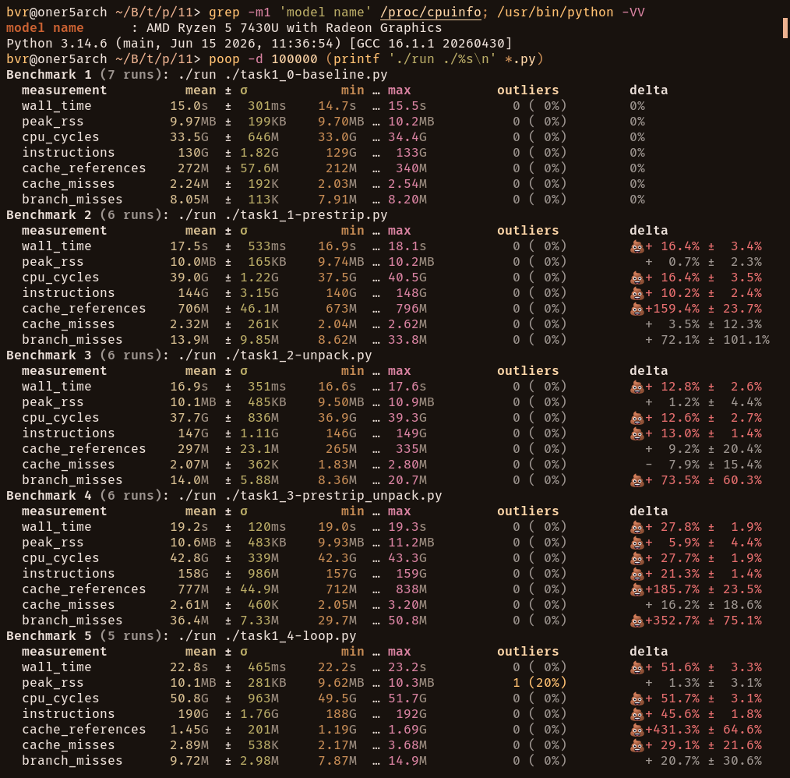
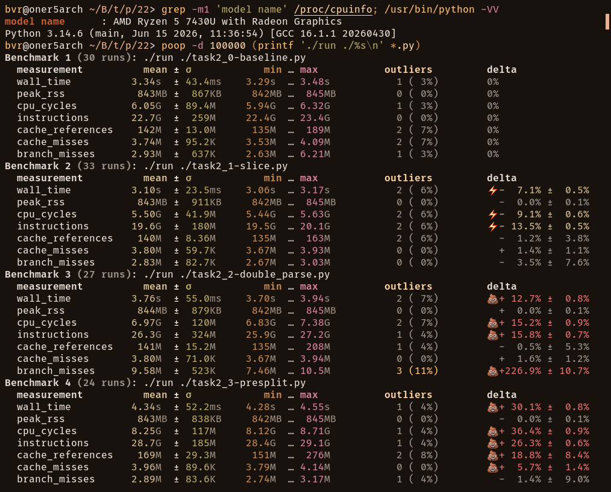

# Benchmark

While performing Tasks 1 and 2, I've discovered various solutions and methods, so making a little benchmark seemed natural to me.
Mainly I was curious about Python implementations behavior under large input workload.

## TOC

<details>
  <summary></summary>

- [Setup](#setup)
- [Results](#results)
  - [Task 1](#task-1)
  - [Task 2](#task-2)
- [Task 1 Source](#task-1-source)
  - [Generator](#generator)
  - [Python](#python)
    1. [Baseline](#baseline)
    2. [Pre-strip](#pre-strip)
    3. [Unpack](#unpack)
    4. [Strip + Unpack](#strip--unpack)
    5. [Enumerate](#enumerate)
- [Task 2 Source](#task-2-source)
  - [Generator](#generator-1)
  - [Python](#python-1)
    1. [Baseline](#baseline-1)
    2. [Slice](#slice)
    3. [Double-parse](#double-parse)
    4. [Pre-split](#pre-split)

</details>

## Setup

- **System:** Linux, 7.1.5-arch1-2 kernel
- **CPU:** AMD Ryzen 5 7430U
- **Python:** 3.14.6

I used precompiled Rust binaries as data generators and piped output directly to Python scripts, without producing any later output.

Binaries can be compiled from source ([task1](#generator), [task2](#generator-1)) with:

```sh
rustc -O gen.rs -o genrs
```

This excludes noise like disk I/O, Python interpreter spin-ups, stdout flush, and allows to measure only Python computations itself, as it remained (mostly) the only variable.<br>

For each task I used `10,000,000` input rows, generated from exact data specified in task conditions.

For measurements I used tool named [**`poop`**](https://github.com/andrewrk/poop) (**P**erformance **O**ptimizer **O**bservation **P**latform).<br>
Unlike [`hyperfine`](https://github.com/sharkdp/hyperfine), it provides some useful hardware metrics besides pure wall time.<br>
But it also has a downside of not invoking shell for commands, so I used simple Bash [wrapper](./src/run.sh):

```bash
#!/usr/bin/env bash

./genrs 10000000 | "$1" >/dev/null
```

Each test ran for 100 seconds under the same system conditions.

```sh
poop -d 100000 'command1' 'command2' ...
```

## Results

#### Task 1

| Method | Wall time (mean ± σ) | Peak RSS (mean ± σ) | WT delta | 🏆 |
|---|---:|---:|---:|---|
| [Baseline](#baseline) | 15.0s  ±  301ms | 9.97MB ±  199KB |  |  |
| [Pre-strip](#pre-strip) | 17.5s  ±  533ms | 10.0MB ±  165KB | + 16.4% | 💩 |
| [Unpack](#unpack) | 16.9s  ±  351ms | 10.1MB ±  485KB | + 12.8% | 💩 |
| [Strip+Unpack](#strip--unpack) | 19.2s  ±  120ms | 10.6MB ±  483KB | + 27.8% | 💩 |
| [Enumerate](#enumerate) | 22.8s  ±  465ms | 10.1MB ±  281KB | + 51.6% | 💩 |

<details>
  <summary><b>Screenshot</b></summary>

  

</details>

---

#### Task 2

| Method | Wall time (mean ± σ) | Peak RSS (mean ± σ) | WT delta | 🏆 |
|---|---:|---:|---:|---|
| [Baseline](#baseline-1) | 3.34s ± 43.4ms | 843MB ± 867KB |  |  |
| [Slice](#slice) | 3.10s ± 23.5ms | 843MB ± 911KB | -  7.1% | ⚡ |
| [Double-parse](#double-parse) | 3.76s ± 55.0ms | 844MB ± 879KB | + 12.7% | 💩 |
| [Pre-split](#pre-split) | 4.34s ± 52.2ms | 843MB ± 838KB | + 30.1% | 💩 |

<details>
  <summary><b>Screenshot</b></summary>

  

</details>

## Task 1 Source

### [Generator](./src/task_1/gen.rs)

```rust
use std::io::{self, BufWriter, Write};

const RAW_USER_RECORD: &[u8; 48] =
    b" 10827 ; aLeXanDer_vLaDimiRov ; mInSk ; ACTIVE \n";

fn main() -> io::Result<()> {
    let num: usize = std::env::args()
        .nth(1)
        .and_then(|s| s.parse().ok())
        .unwrap_or(10_000);

    let stdout = io::stdout();
    let mut writer = BufWriter::with_capacity(64 * 1024, stdout.lock());

    for _ in 0..num {
        writer.write_all(RAW_USER_RECORD)?;
    }

    writer.flush()?;
    Ok(())
}
```

### Python

#### [Baseline](./src/task_1/task1_0-baseline.py)

```python
for raw_user_record in sys.stdin:
    user_record = raw_user_record.split(";")

    user_record[0] = f"UID-{user_record[0].strip()}"
    user_record[1] = user_record[1].strip().replace("_", " ").title()
    user_record[2] = user_record[2].strip().upper()
    user_record[3] = user_record[3].strip().lower()

    normalized = f"Normalized record: {' | '.join(user_record)}"
```

#### [Pre-strip](./src/task_1/task1_1-prestrip.py)

```python
for raw_user_record in sys.stdin:
    user_record = [field.strip() for field in raw_user_record.split(";")]

    user_record[0] = f"UID-{user_record[0]}"
    user_record[1] = user_record[1].replace("_", " ").title()
    user_record[2] = user_record[2].upper()
    user_record[3] = user_record[3].lower()

    normalized = f"Normalized record: {' | '.join(user_record)}"
```

#### [Unpack](./src/task_1/task1_2-unpack.py)

```python
for raw_user_record in sys.stdin:
    uid_raw, name_raw, city_raw, status_raw = raw_user_record.split(";")

    uid = f"UID-{uid_raw.strip()}"
    name = name_raw.strip().replace("_", " ").title()
    city = city_raw.strip().upper()
    status = status_raw.strip().lower()

    normalized = f"Normalized record: {' | '.join([uid, name, city, status])}"
```

#### [Strip + Unpack](./src/task_1/task1_3-prestrip_unpack.py)

```python
for raw_user_record in sys.stdin:
    uid_raw, name_raw, city_raw, status_raw = [
        field.strip() for field in raw_user_record.split(";")
    ]

    uid = f"UID-{uid_raw}"
    name = name_raw.replace("_", " ").title()
    city = city_raw.upper()
    status = status_raw.lower()

    normalized = f"Normalized record: {' | '.join([uid, name, city, status])}"
```

#### [Enumerate](./src/task_1/task1_4-loop.py)
```python
for raw_user_record in sys.stdin:
    user_record = raw_user_record.split(";")

    for i, field in enumerate(user_record):
        match i:
            case 0:
                user_record[0] = f"UID-{field.strip()}"
            case 1:
                user_record[1] = field.strip().replace("_", " ").title()
            case 2:
                user_record[2] = field.strip().upper()
            case 3:
                user_record[3] = field.strip().lower()

    normalized = f"Normalized record: {' | '.join(user_record)}"
```

## Task 2 Source

### [Generator](./src/task_2/gen.rs)

```rust
use std::io::{self, BufWriter, Write};

const RAW_TRANSACTIONS: [&str; 6] = [
    "SUCCESS:100\n",
    "FAILED:50\n",
    "SUCCESS:-10\n",
    "SUCCESS:0\n",
    "SUCCESS:250\n",
    "ERROR:200\n",
];

fn main() -> io::Result<()> {
    let num: usize = std::env::args()
        .nth(1)
        .and_then(|s| s.parse().ok())
        .unwrap_or(10_000);

    let stdout = io::stdout();
    let mut writer = BufWriter::with_capacity(64 * 1024, stdout.lock());

    for i in 0..num {
        writer.write_all(RAW_TRANSACTIONS[i % 6].as_bytes())?;
    }

    writer.flush()?;
    Ok(())
}
```

### Python

Read to a list with:

```python
raw_transactions = sys.stdin.read().splitlines()
```

#### [Baseline](./src/task_2/task2_0-baseline.py)

```python
PREFIX = "SUCCESS:"

sanitized_transactions = [
    amount
    for transaction in raw_transactions
    if transaction.startswith(PREFIX)
    and (amount := int(transaction.removeprefix(PREFIX))) > 0
]
```

#### [Slice](./src/task_2/task2_1-slice.py)

```python
sanitized_transactions = [
    amount
    for transaction in raw_transactions
    if transaction.startswith("SUCCESS:")
    and (amount := int(transaction[8:])) > 0
]
```

#### [Double-parse](./src/task_2/task2_2-double_parse.py)

```python
PREFIX = "SUCCESS:"

sanitized_transactions = [
    int(transaction.removeprefix(PREFIX))
    for transaction in raw_transactions
    if transaction.startswith(PREFIX)
    and int(transaction.removeprefix(PREFIX)) > 0
]
```

#### [Pre-split](./src/task_2/task2_3-presplit.py)

```python
sanitized_transactions = [
    amount_int
    for transaction in raw_transactions
    for status, amount in [transaction.split(":")]
    if status == "SUCCESS" and (amount_int := int(amount)) > 0
]
```
