# SQL Introduction

In this homework I used PostgreSQL DB we had set up in docker container previously.

## TOC

1. [WHERE](#part-1-where)
2. [JOIN](#part-2-join)
3. [GROUP BY](#part-3-group-by)
4. [ORDER BY](#part-4-order-by)
5. [SUBQUERIES](#part-5-subqueries)
6. [WINDOW FUNCTIONS](#part-6-window-functions)
7. [Optional](#part-7-optional)

---
## Part 1: WHERE

### 1. Task 1

```sql
-- Listing columns explicitly as PostgreSQL requires.
-- See p1_task1_v2_duckdb.sql for another aproach.
SELECT
    first_name,
    last_name,
    age,
    country
FROM
    /*
    Despite Appendix A uses PascalCase for naming table during creation,
    PostgreSQL converts unquoted identifiers to lowercase. Acknowledging that
    I will use lowercase for convenience.

    PascalCase could be preserved by creating and referencing the table
    as double-quoted "Customers".
    */
    customers
WHERE
    country = 'USA'
    AND age > 25;
```
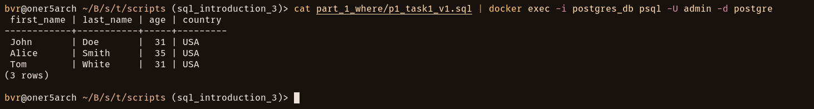

---
### 2. Task 2

```sql
SELECT
    -- Alternatively use '*' here.
    order_id,
    item,
    amount,
    customer_id
FROM
    orders
WHERE
    amount > 1000;
```

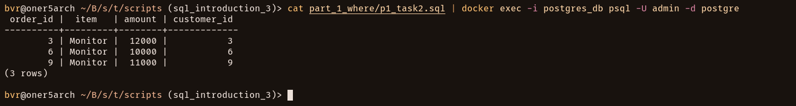

## Part 2: JOIN

### 1. Task 1

```sql
SELECT
    c.first_name,
    c.last_name,
    o.item,
    o.amount
FROM
    orders AS o
    INNER JOIN
        customers AS c
        ON o.customer_id = c.customer_id;
```

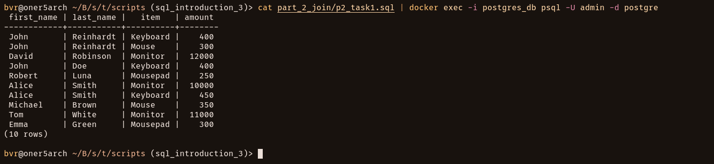

---
### 2. Task 2

```sql
SELECT
    s.status,
    c.first_name,
    c.last_name
FROM
    shippings AS s
    INNER JOIN
        customers AS c
        ON s.customer = c.customer_id
-- To match task example result, though it's not required by task condition.
ORDER BY
    c.age;
```

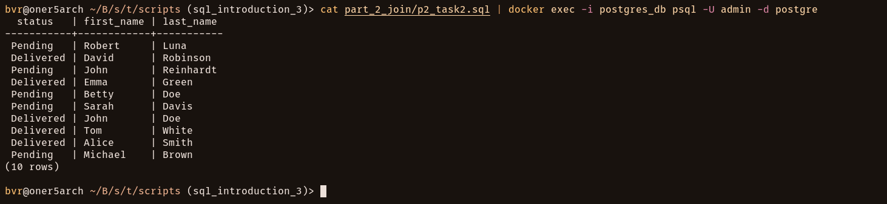

## Part 3: GROUP BY

### 1. Task 1

```sql
SELECT
    country,
    -- To match example column name.
    -- "count" is a bit generic so I'd choose "client_count" or "customer_count"
    COUNT(*) AS count
FROM
    customers
GROUP BY
    country
-- To match task example result, though it's not required by task condition.
ORDER BY
    count DESC,
    country DESC; -- or only this.
```

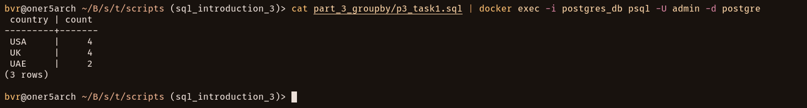

---
### 2. Task 2

- _version 1_
```sql
SELECT
    item,
    COUNT(*)              AS count,
    -- Used TRUNC here to match example, which simply cuts off digits.
    -- Instead, to avoid rounding errors (416.66 vs 416.67) I'd use:

    -- ROUND(AVG(amount), 2) AS avg_amount
    -- AVG(amount)::numeric(12, 2) AS avg_amount -- less type-safe
    TRUNC(AVG(amount), 2) AS avg_amount
FROM
    orders
GROUP BY
    item
/*
To match task example result, though it's not required by task condition.
Use each item's earliest (first-seen) order_id as grouping sort key.
See p3_task2_v2_cte.sql for another approach with exposed order logic.
*/
ORDER BY
    MIN(order_id);
```

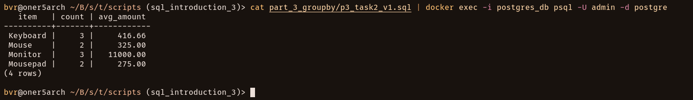

- _version 2_
```sql
WITH
    -- CTE result: calculate first order_id for each item explicitly.
    orders_with_first_id AS (
        SELECT
            item,
            COUNT(*)              AS count,
            -- Using ROUND by intent.
            ROUND(AVG(amount), 2) AS avg_amount,
            MIN(order_id)         AS first_order_id
        FROM
            orders
        GROUP BY
            item
    )

SELECT
    item,
    count,
    avg_amount
FROM
    orders_with_first_id
ORDER BY
    first_order_id;
```

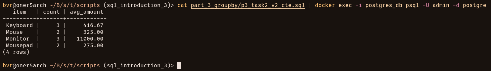

## Part 4: ORDER BY

### 1. Task 1

```sql
SELECT
    first_name,
    age
FROM
    customers
ORDER BY
    --oldmen first
    age DESC;
```

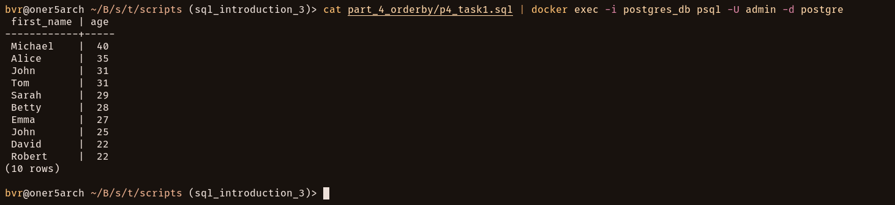

## Part 5: SUBQUERIES

### 1. Task 1

- _version 1_
```sql
SELECT
    c.first_name,
    c.last_name,
    o.amount
FROM
    customers AS c
    INNER JOIN
        orders AS o
        ON c.customer_id = o.customer_id
WHERE
    o.amount = (
        SELECT --noqa: LT09
            MAX(orders.amount)
        FROM
            orders
    );
```

- _version 2_
```sql
-- Using cleaner aliasing here.
SELECT
    c.first_name,
    c.last_name,
    o1.amount
FROM
    customers AS c
    INNER JOIN
        orders AS o1
        ON c.customer_id = o1.customer_id
WHERE
    o1.amount = (
        SELECT --noqa: LT09
            MAX(o2.amount)
        FROM
            orders AS o2
    );
```

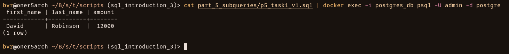

## Part 6: WINDOW FUNCTIONS

### 1. Task 1

```sql
SELECT
    order_id,
    customer_id,
    item,
    amount,
    SUM(amount) OVER (
        PARTITION BY customer_id
    ) AS total_by_customer
FROM
    orders
-- To match task example result, though it's not required by task condition.
ORDER BY
    order_id;
```

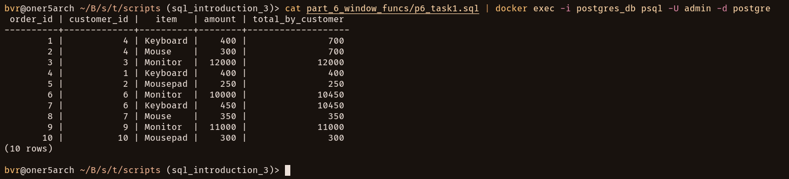

## Part 7: Optional

### 1. Task 1

- _version 1_
```sql
WITH
    -- CTE result: summary table with total orders and amount per customer.
    total_by_customer AS (
        SELECT
            customer_id,
            COUNT(*)    AS total_orders,
            SUM(amount) AS total_amount
        FROM
            orders
        GROUP BY
            customer_id
    )

/*
Dedup possible repeating rows after double-join,
if customer has several delivered shippments using DISTINCT keyword.
See p7_task1_v2.sql for another approach.
*/
SELECT DISTINCT --noqa: ST06
    CONCAT(c.first_name, ' ', c.last_name) AS full_name,
    c.country,
    t.total_orders,
    t.total_amount
FROM
    total_by_customer AS t
    INNER JOIN
        shippings AS s
        ON t.customer_id = s.customer
    INNER JOIN
        customers AS c
        ON t.customer_id = c.customer_id
WHERE
    t.total_orders >= 2
    AND
    s.status = 'Delivered';
```

- _version 2_
```sql
WITH
    -- CTE result: summary table with total orders and amount per customer.
    total_by_customer AS (
        SELECT
            customer_id,
            COUNT(*)    AS total_orders,
            SUM(amount) AS total_amount
        FROM
            orders
        GROUP BY
            customer_id
    ),

    -- CTE result: optimize by deduping here *before* joining.
    delivered_customers AS (
        SELECT DISTINCT customer
        FROM
            shippings
        WHERE
            status = 'Delivered'
    )

SELECT --noqa: ST06
    CONCAT(c.first_name, ' ', c.last_name) AS full_name,
    c.country,
    t.total_orders,
    t.total_amount
FROM
    total_by_customer AS t
    INNER JOIN
        delivered_customers AS d
        ON t.customer_id = d.customer
    INNER JOIN
        customers AS c
        ON t.customer_id = c.customer_id
WHERE
    t.total_orders >= 2;
```

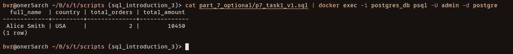
